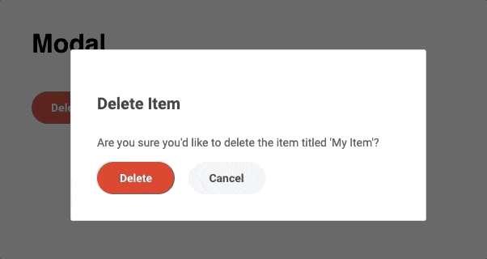
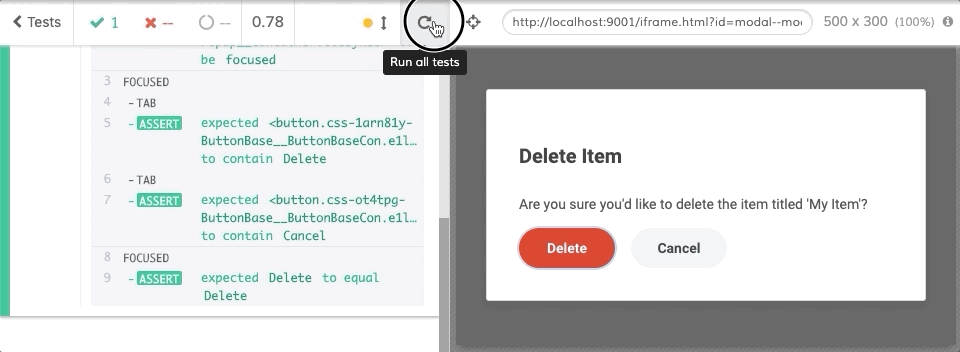
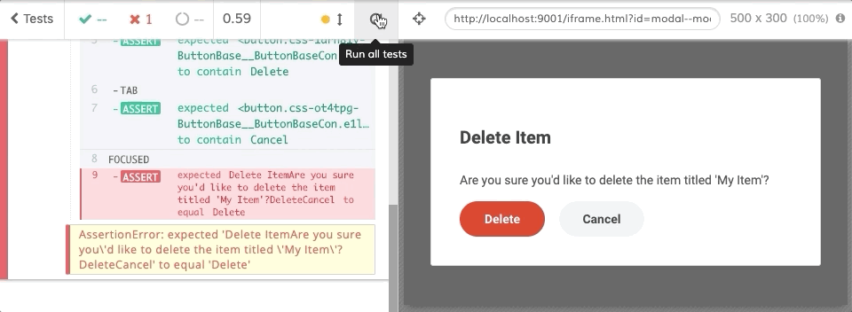
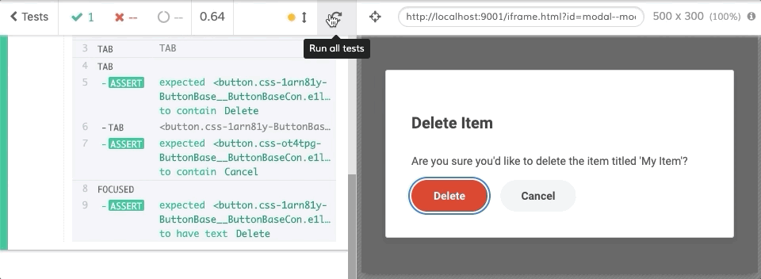

## Testing with the tab key in Cypress

### Using cy.type

As part of testing an accessible modal we need to trap focus inside the element with the `role=dialog`. This involves hitting the tab key. Unfortunately, Cypress doesn't support the tab key. When you try `cy.type('{tab}')`, Cypress gives a nice warning message:

```
CypressError: {tab} isn't a supported character sequence. You'll want to use the command cy.tab(), which is not ready yet, but when it is done that's what you'll use.
```

### Using a cy.tab plugin

Fortunately, there is a nice plugin to support `cy.tab()` that is created by a member of the Cypress team: [cypress-plugin-tab](https://github.com/Bkucera/cypress-plugin-tab). This was working quite well. I was able to finish off my tests without issue until I ran into a new edge case for modals that don't have the close icon.

### Header with tabIndex=-1

According to the [specification](https://www.w3.org/WAI/GL/wiki/Using_ARIA_role%3Ddialog_to_implement_a_modal_dialog_box#Note_on_focus_management), focus should be transferred to the dialog (or something inside) and focus should be held there until the dialog is dismissed. I'm using [react-focus-trap](https://github.com/davidtheclark/focus-trap-react) which uses [tabbable](https://github.com/davidtheclark/tabbable) under the hood to understand where focus should go. The ARIA spec suggests the `role=dialog` can receive focus by setting the `tabindex="-1"`. This works - the element can now receive focus when `element.focus()` is called and when you hit the tab key, the next item in the modal will receive focus properly.



The Cypress test code looks like this:

```ts
it("should trap focus inside the modal element", () => {
  h.modal.get().should("have.focus");
  cy.tab()
    .should("contain", "Delete")
    .tab()
    .should("contain", "Cancel")
    .tab();
  cy.focused().should("have.text", "Delete");
});
```

`h.modal.get()` returns the element with a `role=dialog`. It is then hitting the tab key to move focus to the "Delete" button, then hitting the tab key to move focus to the "Cancel" button and then hitting the tab key to shift focus around to the "Delete" button again. The focus trap should be ensuring focus recycles inside the dialog. The "Delete" and "Cancel" buttons are the only focusable elements within the modal.

`cy.tab` uses [ally.js#tabSequence](https://allyjs.io/api/query/tabsequence.html) which gets a list of tabbable elements so it can determine where the current element is in relation to other tabbable elements. The problem with `tabindex="-1"` is it is not tabbable, so the plugin fails with the following error message:

```
Error: [cypress-plugin-tab]:
        Subject is not a tabbable element
        - Use cy.get('body').tab() if you wish to tab into the first element on the page
        - Use cy.focused().tab() if you wish to tab into the currently active element
```

### Header with tabIndex=0

Our workaround involves instead setting the tab index to be `0` instead and remove the tab index on blur. This should make `cy.tab` happy.

The code looks like this:

```tsx
function onActivate(modalEl: HTMLElement | null) {
  if (modalEl) {
    const firstFocusable = modalEl.querySelector<HTMLElement>(
      "[aria-label=Close]"
    );
    if (!firstFocusable) {
      // If there is no close icon, we need to transfer focus to the dialog.
      // Setting tabIndex allows the dialog to be focusable.
      // We do the dialog instead of the next focusable element to prevent useful context from being skipped
      modalEl.addAttribute("tabIndex", "0");

      const changeTabIndex = () => {
        // We no longer need to focus on the dialog after it looses focus
        // We simply want to transfer focus inside
        modalEl.removeEventListener("blur", changeTabIndex);
        modalEl.removeAttribute("tabIndex");
      };
      modalEl.addEventListener("blur", changeTabIndex);
    }
  }
}

class Modal extends React.Component {
  render() {
    return (
      <FocusTrap
        focusTrapOptions={{
          onActivate: () => onActivate(this.modalRef.current)
        }}
      >
        <Container
          onClick={e => this.handleOutsideClick(handleClose, e)}
          {...elemProps}
        >
          <Popup
            popupRef={this.modalRef}
            width={width}
            heading={heading}
            handleClose={handleClose}
            padding={padding}
            transformOrigin={transformOrigin}
            data-testid={testId}
          >
            {children}
          </Popup>
        </Container>
      </FocusTrap>
    );
  }
}
```

There is a problem though. The test will fail 50% of the time. In fact it fails exactly every-other time it is run.



Running stack traces show different timing. The problem is a race condition. The code removes `tabIndex` inside the `blur` without allowing a frame to be drawn. The `cy.tab` also runs without allowing a frame to be drawn. You can tell because the video doesn't show focus moving from the dialog (focus ring around the whole modal) to the "Delete" button to the "Cancel" button and back to the "Delete" button. On the times that the test fails, the `tabIndex` is removed _before_ `cy.tab` runs and an error is thrown because the `role=dialog` is no longer focusable. The times it passes, `cy.tab` is run _before_ the `tabIndex` is removed and everything is happy.

So how can this be fixed? We can add a `requestAnimationFrame` to the `tabIndex` removal to force a single frame to be rendered thus allowing any DOM changes to be flushed before removing it.



Hmm, now the issue is `cy.tab` doesn't wait at all between tabs and so it focuses back to the `role=dialog` element before the `tabIndex` is removed. The `cy.tab` command must also wait for a frame to happen before allowing the Cypress command chain from moving on. Cypress runs in the same UI thread as your application does, so many Cypress commands can run before the application even renders a frame. Cypress can even hold the UI thread hostage not allowing frames to be rendered between commands like how `cypress-plugin-tab` is implemented. Many Cypress commands use an internal [actionability](https://github.com/cypress-io/cypress/blob/73378fb191913e42a5bc7821b2540ac460df7048/packages/driver/src/cy/actionability.coffee) or simply [use a timeout](https://github.com/cypress-io/cypress/blob/a038e7f5d4c56d3efa844e745da40a3d917fefea/packages/driver/src/cy/commands/actions/type.js#L327) to allow your application to properly respond to events.

I've opened an [issue](https://github.com/Bkucera/cypress-plugin-tab/issues/4) on the plugin. In the meantime, the following allows the tests to work consistently:

```js
import "cypress-plugin-tab";

const raf = () =>
  new Cypress.Promise(resolve => {
    cy.state("window").requestAnimationFrame(resolve);
  });

Cypress.Commands.overwrite("tab", (originalFn, subject) => {
  return raf().then(() => {
    return originalFn(subject);
  });
});
```

Now the tests pass consistently. The side effect of this change is you can now the focus shifting during the test. I've slowed it down to see the effect:



**Update:** This issue was fixed in https://github.com/Bkucera/cypress-plugin-tab/pull/7! No modification needed.

### Tab key inside a focus trap

Another issue I ran into was using `cy.tab` with the `focus-trap`. Focus trap works by cancelling the `keydown` event to prevent the browser from switching focus outside the trap. `cy.tab` returns an `undefined` subject in this case preventing correct chaining. This is how `cy.tab` currently handles cancelled `keydown` events.

For example:

```ts
cy.tab()
  .should("have.text", "Cancel")
  .tab()
  .should("have.text", "Delete"); // this fails because the subject is now undefined
```

The workaround is to force `cy.tab` to always return the currently focused element in the document:

```ts
Cypress.Commands.overwrite("tab", (originalFn, subject) => {
  return originalFn(subject).then(
    // return subject if defined else return current focused element
    s => s || cy.state("window").document.activeElement
  );
});
```
